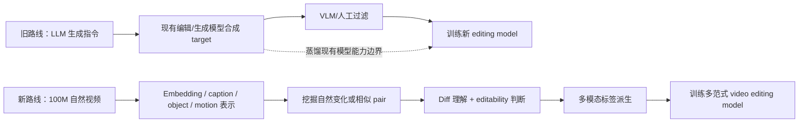

# Video Editing 数据集项目文献调研（截至 2026-05-25）

> 目标：围绕“从大规模自然视频中无监督/弱监督挖掘 video editing 数据，而不是继续依赖 LLM 生成指令 + 现有 editing model 合成 target video”的路线，梳理最相关、最有参考价值的研究脉络。

## 0. 总结先行

我们要做的事情处在几个方向的交叉点：

1. **Instruction-based editing 数据构造**：已有路线大多是先用 LLM 生成 edit instruction，再用 T2I/I2I/V2V 模型合成 edited sample，最后用 VLM/人工过滤。优点是可控，缺点是强烈蒸馏现有生成/编辑模型的能力边界。
2. **自然视频作为 supervision**：视频天然包含 object motion、pose change、viewpoint change、camera motion、lighting progression 等“真实变化”。这些变化不是人工 prompt 想出来的，也不是 editing model 生成出来的，是更接近真实世界的 edit signal。
3. **pair-free / unpaired editing**：已有工作已经开始绕过 paired before/after 数据，使用 cycle consistency、degradation simulation、in-context unpaired clips 等方式学习编辑能力。
4. **difference captioning / comparative video understanding**：我们的核心瓶颈不是“给单个视频 caption”，而是判断两个 clip 的差异是否可被编辑指令解释，并把差异写成可训练的 instruction。
5. **large-scale retrieval / embedding mining**：100M 规模下，第一阶段必须用 embedding + ANN 做高召回候选挖掘，但最终质量不能只依赖 embedding cosine similarity。

本调研的核心判断：

- **直接沿用合成数据路线会受限于现有 video editing model**，尤其是局部编辑、长视频、复杂 motion、camera/temporal edit、精确 identity/reference 控制。
- **纯 embedding diff 不足以直接生成 instruction**；embedding 更适合做 candidate mining 和粗 taxonomy routing，不能作为最终语义解释器。
- **MLLM 可以参与 pair 判定和 diff caption，但必须被约束为 verifier/captioner cascade**，不能一把梭地相信“两个视频能否互相编辑得到”的单次判断。
- **最有潜力的收敛方向是 hybrid data factory**：自然 mined pairs 做主体，少量 synthetic/control seed 做校准，multi-label 派生支持 T2V、I2V、reference-guided、mask-conditioned、first-frame propagation、multi-turn 等多种训练格式。

---

## 1. 应关注的文献领域地图

### 1.1 合成式 instruction editing 数据集

这条线回答：过去大家如何规模化构造 `(source, instruction, target)`？它也是我们要避免“老路”的主要参照物。

关注点：

- instruction 如何生成；
- target 如何由模型合成；
- 如何过滤；
- 数据是否受限于 generator/editor 的能力边界；
- 是否覆盖 text-only、mask、reference、多轮、多任务。

### 1.2 Video editing 数据集与 benchmark

这条线回答：当前 video editing 训练数据长什么样？主流任务 taxonomy 是什么？评价如何做？

关注点：

- 视频对是否真实、合成、或半合成；
- 编辑类型覆盖：global style、background、local add/remove/replace、camera、motion、subtitle、creative edit；
- 时长、分辨率、帧数、保真度；
- 是否支持 instruction-only、reference-guided、mask-conditioned。

### 1.3 Pair-free / unpaired / self-supervised editing

这条线回答：如果没有 aligned before/after pair，如何学习 editing？

关注点：

- cycle consistency；
- degradation simulation；
- in-context unpaired clips；
- motion restoration / tube shuffle / speed perturbation 等 pretext task；
- 是否能作为我们自然视频数据挖掘失败时的 fallback。

### 1.4 从视频挖 image/video editing supervision

这条线最接近我们的核心想法。

关注点：

- 是否从自然视频帧或 clip 中挖 paired supervision；
- 如何过滤 frame/clip pair；
- 如何让 MLLM 生成差异指令；
- 能覆盖哪些“合成数据很难模拟”的变化。

### 1.5 Difference captioning 与多视频比较理解

这条线对应我们 pipeline 里最关键的 `pair -> diff -> instruction`。

关注点：

- 两张图/两段视频的差异如何定位和表达；
- 如何区分相似点与差异点；
- MLLM 在 cross-video reasoning 上有哪些短板；
- 是否有 benchmark 可用于标注器/验证器评估。

### 1.6 大规模视频理解、caption、retrieval 与 grounding

这条线提供工程底座。

关注点：

- 100M clips 的 caption/embedding 能否自动化；
- 视频 embedding 是否需要 whole-clip、frame-level、object-level、motion-level 多粒度；
- ANN 检索、近重复过滤、局部匹配、object tracking 如何组合；
- SAM 2 / Grounding / VLM 如何支持 local edit mining。

---

## 2. 合成式 instruction image editing 数据路线

### 2.1 InstructPix2Pix — Learning to Follow Image Editing Instructions（CVPR 2023）

- 链接：[arXiv:2211.09800](https://arxiv.org/abs/2211.09800)
- 核心：用 GPT-3 生成 `(input caption, edit instruction, output caption)`，再用 Prompt-to-Prompt 生成对应 image pair，训练一个能根据自然语言指令编辑图片的 diffusion model。
- 贡献：奠定了 instruction-based image editing 的基本数据范式：**先合成语义变化，再合成像素 before/after pair**。
- 局限：target image 来自已有 T2I/editing pipeline，数据质量和编辑能力被 generator 限制；对复杂非刚体变化、视角变化、真实物理动态覆盖不足。
- 对本项目启发：这是我们要绕开的“老路”的原型。它证明合成路线能 scale，但也说明合成数据会继承模型偏差。

### 2.2 MagicBrush — Manually Annotated Image Editing Dataset（NeurIPS 2023）

- 链接：[项目页](https://osu-nlp-group.github.io/MagicBrush/)
- 核心：人工构造高质量 instruction-guided image editing 数据，包含多轮编辑。
- 贡献：强调 instruction 的自然性、真实用户需求、多轮编辑一致性。
- 局限：人工成本高，规模小，难迁移到 video 的百万级训练。
- 对本项目启发：可以作为 calibration / human gold set 的风格参考，而不是作为主数据来源。

### 2.3 Emu Edit — Precise Image Editing via Recognition and Generation Tasks（CVPR 2024）

- 链接：[arXiv:2311.10089](https://arxiv.org/abs/2311.10089)
- 核心：把多类 recognition/generation 任务统一成 image editing 任务，并用 task embedding 控制编辑类型。
- 贡献：证明“编辑能力”不只是 prompt-following，还需要显式任务类型和多任务训练。
- 局限：仍依赖构造好的任务和数据；video 中的 temporal preservation 没被解决。
- 对本项目启发：我们的 diff taxonomy 不应只是描述性标签，而可以作为训练时的 task embedding / routing signal。

### 2.4 HQ-Edit — High-Quality Dataset for Instruction-based Image Editing（2024 / ICLR 2025）

- 链接：[arXiv:2404.09990](https://arxiv.org/abs/2404.09990)
- 核心：用 GPT-4V 和 DALL·E 3 构造约 200K 高质量 image edit pairs，并用 Alignment / Coherence 做质量评估。
- 贡献：强调高质量数据比盲目规模更重要；使用 VLM 评估 pair alignment。
- 局限：合成 target 仍来自强生成模型；数据规模和编辑类型受模型可控性限制。
- 对本项目启发：质量过滤必须同时看 **instruction alignment** 和 **content preservation**，不能只看 target aesthetic。

### 2.5 UltraEdit — Instruction-based Fine-Grained Image Editing at Scale（NeurIPS 2024）

- 链接：[arXiv:2407.05282](https://arxiv.org/abs/2407.05282)
- 核心：自动生成约 4M image editing samples，使用真实图像作为 source，并支持 region-based editing annotations。
- 贡献：证明 real image anchor + region annotation 对 fine-grained editing 很关键。
- 局限：仍主要是 image editing；视频时序一致性和 motion edit 没有覆盖。
- 对本项目启发：大规模数据不应只存 text instruction；最好同步派生 mask、region、object metadata。

### 2.6 AnyEdit — Mastering Unified High-Quality Image Editing for Any Idea（CVPR 2025）

- 链接：[arXiv:2411.15738](https://www.emergentmind.com/papers/2411.15738)，[项目页](https://dcd-anyedit.github.io/)
- 核心：构造 2.5M 多模态 instruction editing pairs，覆盖 20+ 编辑类型和多个领域，并训练 task-aware unified editor。
- 贡献：把 instruction、visual prompt、多任务编辑统一到一个数据和模型框架。
- 局限：依然是合成/自动编辑结果为主；“真实自然变化”不是主要监督来源。
- 对本项目启发：最终数据资产应支持多模态 conditioning，而不是只产 text-only triplet。

### 2.7 ImgEdit — Unified Image Editing Dataset and Benchmark（2025）

- 链接：[arXiv:2505.20275](https://arxiv.org/abs/2505.20275)
- 核心：1.2M 高质量 image-edit pairs，包含复杂单轮和多轮编辑；构建 ImgEdit-Bench。
- 贡献：把数据、模型、benchmark 一起设计，覆盖 instruction adherence、editing quality、detail preservation。
- 局限：图像为主；自动构造依赖 VLM、detection、segmentation、inpainting pipeline。
- 对本项目启发：我们的项目也应该同步产出一个小型 benchmark/gold set，否则数据质量不可量化。

### 2.8 Instruct-CLIP — Automated Data Refinement Using Contrastive Learning（CVPR 2025）

- 链接：[arXiv:2503.18406](https://arxiv.org/abs/2503.18406)
- 核心：用 self-supervised contrastive learning 学习 image pair 的 semantic change，并据此修正 noisy editing instruction。
- 贡献：正面处理“caption/instruction 与真实视觉变化不一致”的问题。
- 局限：image pair 的差异比 video pair 简单；对多维纠缠差异仍难。
- 对本项目启发：可以训练一个 video-level Instruct-CLIP / diff verifier，用来校验 MLLM 生成的 instruction 是否真的解释了 pair 的视觉变化。

### 2.9 NoHumansRequired / NHR-Edit — Autonomous High-Quality Image Editing Triplet Mining（2025）

- 链接：[arXiv:2507.14119](https://arxiv.org/abs/2507.14119)
- 核心：用公开生成模型 + task-tuned Gemini validator 自动挖高质量 image editing triplets，释放 NHR-Edit。
- 贡献：给出工业级自动构造 pipeline 的 survival-rate 思路：每阶段保留率、成本、质量都要统计。
- 局限：本质还是生成式 triplet mining；validator 是否能泛化到自然 pair 判定仍需验证。
- 对本项目启发：我们要记录每个过滤器的通过率，建立 “data funnel accounting”。

### 2.10 GPT-IMAGE-EDIT-1.5M（2025）

- 链接：[arXiv:2507.21033](https://arxiv.org/abs/2507.21033)
- 核心：构造 1.5M GPT-generated image editing triplets，用于训练强 instruction-following image editor。
- 贡献：说明闭源强模型可大幅提升合成编辑数据质量。
- 局限：更明显地蒸馏闭源模型能力；长尾 task 仍取决于模型会不会做。
- 对本项目启发：可以用少量强模型合成数据作为 seed / calibration，而不是主数据来源。

---

## 3. Instruction video editing 数据集与 benchmark

### 3.1 InsV2V / Instruct Video-to-Video — Consistent Video-to-Video Transfer Using Synthetic Dataset（ICLR 2024）

- 链接：[项目页](https://cplusx.github.io/InsV2V_project_page/)，[GitHub](https://github.com/amazon-science/instruct-video-to-video)
- 核心：把 InstructPix2Pix 的 synthetic instruction editing 范式扩展到视频，构造视频编辑数据训练 instruction video-to-video 模型。
- 贡献：较早把 instruction-based editing 从 image 推向 video。
- 局限：数据分辨率、帧数、编辑质量和 temporal consistency 受合成流程限制；本质仍是旧路线。
- 对本项目启发：旧路线在 video 中成本和质量问题会被放大，尤其是 motion 和未编辑区域保真。

### 3.2 InsViE-1M — Effective Instruction-based Video Editing with Elaborate Dataset Construction（ICCV 2025）

- 链接：[arXiv:2503.20287](https://arxiv.org/abs/2503.20287)
- 核心：构造 1M video editing triplets。流程包括高质量 source curation、first-frame 多强度编辑、GPT-4o 过滤、传播到后续帧、再次过滤。
- 贡献：系统化提升了 source 质量、filter 质量、训练策略，是 2025 年重要 video editing dataset。
- 局限：仍依赖 first-frame editing + propagation；复杂时序 edit、非首帧局部变化、camera/motion 修改覆盖有限。
- 对本项目启发：自然数据挖掘路线要特别避免只学到“首帧编辑后传播”的偏置。

### 3.3 Señorita-2M — High-Quality Instruction-based Dataset for General Video Editing by Video Specialists（2025）

- 链接：[arXiv:2502.06734](https://arxiv.org/abs/2502.06734)，[项目页](https://senorita-2m-dataset.github.io/)
- 核心：用四个专门训练的 video editing experts 构造约 2M video editing pairs，并过滤低质量样本。
- 贡献：强调 task-specialist video editors 在数据构造中的价值。
- 局限：数据上限来自 specialist editors；如果 specialist 不会做某类编辑，数据就覆盖不到。
- 对本项目启发：synthetic specialist 适合作补充长尾，但不能替代自然视频中真实变化。

### 3.4 Ditto-1M — Scaling Instruction-Based Video Editing with a High-Quality Synthetic Dataset（2025）

- 链接：[arXiv:2510.15742](https://arxiv.org/abs/2510.15742)
- 核心：构建 Ditto framework，融合强 image editor 和 in-context video generator，投入超过 12,000 GPU-days 生成 1M 高质量 synthetic video editing examples。
- 贡献：给出了当前高质量合成 video editing 数据的强基线，也给出了成本基线。
- 局限：成本极高；合成 target 仍受 image editor / video generator 的能力边界约束。
- 对本项目启发：如果自然挖掘路线成功，成本-规模曲线可能明显优于 12K GPU-days / 1M samples 的合成路线。

### 3.5 OpenVE-3M / OpenVE-Bench（2025）

- 链接：[arXiv:2512.07826](https://arxiv.org/abs/2512.07826)
- 核心：3M instruction-guided video editing dataset，覆盖 spatially-aligned 和 non-spatially-aligned edits；同时提出 431 pair 的 OpenVE-Bench。
- 贡献：taxonomy 较完整，包括 Global Style、Background Change、Local Change、Local Remove、Local Add、Subtitles Edit、Camera Multi-Shot Edit、Creative Edit。
- 局限：仍是“精心设计生成 pipeline + 质量过滤”的路线，数据不是从自然 pair 中挖出来的。
- 对本项目启发：OpenVE taxonomy 可作为我们首版 taxonomy 的重要参考，但需要加入“natural-change-derived”类别。

### 3.6 ReCo / ReCo-Data — Region-Constrained In-Context Generation for Instructional Video Editing（2025）

- 链接：[arXiv:2512.17650](https://arxiv.org/abs/2512.17650)
- 核心：把 video editing 重新表述为 region-constrained in-context generation，构造约 500K instruction-video pairs，聚焦 add/remove/replace/style 等局部/全局任务。
- 贡献：强调 region constraint、mask、局部编辑边界在数据质量中的作用。
- 局限：仍需要合成 edited target；region/mask 构造链路复杂。
- 对本项目启发：自然 pair mining 不应只在 clip-level 做；object/region-level mining 会更接近可编辑差异。

### 3.7 Kiwi-Edit / RefVIE — Instruction + Reference Guided Video Editing（2026）

- 链接：[arXiv:2603.02175](https://arxiv.org/abs/2603.02175)
- 核心：将已有 video editing triplets 转换为 `(source video, instruction, reference image, target video)` quadruplets，构造 RefVIE，并训练 instruction-reference guided video editing model。
- 贡献：指出自然语言对复杂视觉细节的描述能力有限，reference image 是必要补充。
- 局限：reference 是从已有 triplet 派生/合成；基础 pair 仍来自已有 editing data。
- 对本项目启发：我们挖到自然 `(A, B)` pair 后，不应只生成 text instruction；应同步派生 reference frame / subject crop / region crop。

### 3.8 IVEBench — Modern Benchmark Suite for Instruction-Guided Video Editing Assessment（2025）

- 链接：[arXiv:2510.11647](https://arxiv.org/abs/2510.11647)
- 核心：600 个高质量 source videos，8 类编辑任务、35 个子类，使用 video quality、instruction compliance、video fidelity 三维评价。
- 贡献：为 instruction-guided video editing 建立更系统的 benchmark。
- 局限：benchmark 不是数据构造 pipeline；规模小。
- 对本项目启发：我们的 pilot 必须有类似三维评价，否则只看 CLIPScore 很容易误判。

### 3.9 VEFX-Bench / VEFX-Reward（2026）

- 链接：[arXiv:2604.16272](https://arxiv.org/abs/2604.16272)
- 核心：面向 generic video editing 与 visual effects 的 benchmark，并提出 reward model 评估编辑质量。
- 贡献：把 video editing 从简单 instruction following 推向专业 visual effects 质量评估。
- 局限：更偏 evaluation/reward，不是自然数据挖掘。
- 对本项目启发：后期可以训练项目自有 edit reward model，用于大规模过滤。

---

## 4. Pair-free / unpaired / self-supervised editing

### 4.1 CycleGAN — Unpaired Image-to-Image Translation（ICCV 2017）

- 链接：[arXiv:1703.10593](https://arxiv.org/abs/1703.10593)
- 核心：没有 aligned pair 时，用 adversarial loss + cycle consistency 学习 domain translation。
- 贡献：奠定 unpaired translation 的基本思想。
- 局限：domain-level 映射，难做 instance-level precise editing；cycle consistency 可能保留隐藏信息或导致不真实约束。
- 对本项目启发：cycle consistency 可用于 verifier 或 self-supervised pretraining，但不能直接解决 instruction-level pair mining。

### 4.2 CUT — Contrastive Learning for Unpaired Image-to-Image Translation（ECCV 2020）

- 链接：[arXiv:2007.15651](https://arxiv.org/abs/2007.15651)
- 核心：用 patch-level contrastive loss 替代/增强 cycle consistency，保持输入输出局部内容对应。
- 贡献：从“重建回原图”转向“局部语义对应保持”。
- 局限：主要是 image domain translation；对开放编辑指令和视频时序仍不足。
- 对本项目启发：可以借鉴 patch/object-level contrastive preservation，训练自然 pair verifier。

### 4.3 Recycle-GAN — Unsupervised Video Retargeting（ECCV 2018）

- 链接：[arXiv:1808.05174](https://arxiv.org/abs/1808.05174)
- 核心：把 cycle consistency 扩展到视频，加入时序预测/temporal constraints。
- 贡献：说明 video unpaired translation 必须显式处理时间一致性。
- 局限：适合 domain retargeting，不适合开放式 instruction editing。
- 对本项目启发：对同源 clip 中 motion/state/camera 变化的建模，需要 temporal consistency 约束。

### 4.4 UIP2P — Unsupervised Instruction-based Image Editing via Cycle Edit Consistency（2024）

- 链接：[arXiv:2412.15216](https://arxiv.org/abs/2412.15216)
- 核心：不需要 ground-truth edited image，通过 forward/backward edit 和 image/attention space consistency 训练 instruction image editing。
- 贡献：直接挑战 `(input, instruction, target)` 三元组依赖。
- 局限：image editing；要求 instruction 和反向 instruction 仍然可得。
- 对本项目启发：如果自然 pair 难挖，可以把自然视频 caption + synthetic/reverse instruction 用作 pair-free pretraining。

### 4.5 ICVE — In-Context Learning with Unpaired Clips for Instruction-based Video Editing（2025）

- 链接：[arXiv:2510.14648](https://arxiv.org/abs/2510.14648)
- 核心：用约 1M unpaired real video clips 做低成本 pretraining，让模型学到 add/replace/delete 等基础 editing concept，再用少量 paired data fine-tune。
- 贡献：明确证明 video editing 可以从 unpaired clips 中学到部分编辑能力。
- 局限：没有显式挖 `(A, B)` edit pairs；最终仍需 <150K paired high-quality data 提升效果。
- 对本项目启发：我们可以把 unpaired self-supervised pretraining 和自然 pair mining 合并：先学 preservation/motion prior，再用 mined pairs 学 instruction alignment。

### 4.6 NOVA — Sparse Control, Dense Synthesis for Pair-Free Video Editing（2026）

- 链接：[arXiv:2603.02802](https://arxiv.org/abs/2603.02802)
- 核心：pair-free video editing；sparse branch 提供编辑 keyframe 语义控制，dense branch 保留原视频 motion/texture，并用 degradation-simulation training 学 temporal reconstruction。
- 贡献：直接指出自然 aligned video editing pair 难以规模化收集，尤其是 local video editing。
- 局限：需要 edited keyframes 作为 sparse control；不直接产出 instruction dataset。
- 对本项目启发：对于难以挖 pair 的编辑类型，可以转为“自然视频 + sparse edited keyframes + dense original video”的训练格式。

### 4.7 SAMA — Factorized Semantic Anchoring and Motion Alignment（2026）

- 链接：[arXiv:2603.19228](https://arxiv.org/abs/2603.19228)
- 核心：把 video editing 分解为 Semantic Anchoring 和 Motion Alignment；用 motion-centric restoration pretext tasks（cube inpainting、speed perturbation、tube shuffle）从 raw videos 学 temporal dynamics。
- 贡献：说明 raw videos 本身可提供强 motion/preservation pretraining signal。
- 局限：不是直接的数据集构造方法；需要后续 supervised fine-tuning。
- 对本项目启发：我们的 pipeline 不应只关心 pair mining，也应该从 100M 原始视频中抽取 self-supervised temporal tasks。

---

## 5. 从自然视频挖 editing supervision

### 5.1 InstructMove — Instruction-based Image Manipulation by Watching How Things Move（CVPR 2025）

- 链接：[arXiv:2412.12087](https://arxiv.org/abs/2412.12087)
- 核心：从视频中采样 frame pairs，用 MLLM 生成 edit instruction，训练 image manipulation model。视频帧天然保持 subject/scene identity，同时提供非刚体运动、视角变化、camera movement 等真实变化。
- 贡献：这是与我们想法最接近的已验证范式，只是它做 image editing，而不是 video editing。
- 局限：frame pair 比 clip pair 简单；主要覆盖 motion/pose/view/camera 等自然变化，不覆盖大量 synthetic-style edits。
- 对本项目启发：
  - 同源视频内部 pair 是最可靠的自然监督来源；
  - MLLM 适合生成差异指令，但需要先过滤 pair；
  - 自然视频挖掘更擅长非刚体、视角、姿态、动作类编辑。

### 5.2 VINCIE — Unlocking In-context Image Editing from Video（2025/2026）

- 链接：[arXiv:2506.10941](https://arxiv.org/abs/2506.10941)
- 核心：从视频构造多模态序列训练 in-context image editing，强调 video-only training paradigm。
- 贡献：进一步证明视频动态可以成为 image editing 的 scalable supervision。
- 局限：仍以 image editing / in-context image generation 为主。
- 对本项目启发：可以从同一视频提取多帧/多 clip chain，构造 multi-turn editing 数据。

---

## 6. Difference captioning 与比较理解

### 6.1 Spot-the-Diff / CLEVR-Change / Image-Editing-Request / Birds-to-Words

- 链接：
  - [Spot-the-Diff dataset](https://github.com/harsh19/spot-the-diff)
  - [CLEVR-Change](https://github.com/Seth-Park/RobustChangeCaptioning)
- 核心：给定两张相似图片，生成描述差异的 caption。
- 贡献：定义了“不是 caption 单张图，而是 caption 两者差异”的任务。
- 局限：多为 image pair，且 benchmark 场景和真实视频 editing 差距大。
- 对本项目启发：我们的 caption prompt 必须要求模型先列共同点，再列所有差异，再判断哪些差异可编辑。

### 6.2 VIXEN — Visual Text Comparison Network for Image Difference Captioning（2024）

- 链接：[arXiv:2402.19119](https://arxiv.org/abs/2402.19119)
- 核心：用合成 manipulated images 扩展差异类型，提升 image difference captioning。
- 贡献：把 editing data 和 difference captioning 连起来。
- 局限：合成图像差异和自然视频差异不同。
- 对本项目启发：可以用少量 synthetic edit pairs 训练/校准 diff captioner，再迁移到自然 mined pairs。

### 6.3 OneDiff — Generalist Model for Image Difference Captioning（ACCV 2024）

- 链接：[arXiv:2407.05645](https://arxiv.org/abs/2407.05645)
- 核心：siamese image encoder + Visual Delta Module，训练通用 image difference captioner。
- 贡献：直接处理 pair 表示和差异语言化之间的桥梁。
- 局限：image-level；video temporal difference、motion continuity、camera dynamics 不覆盖。
- 对本项目启发：`embedding_B - embedding_A` 不应裸用；需要类似 Visual Delta Module 的 learned diff module。

### 6.4 OmniDiff — Fine-grained Image Difference Captioning Benchmark（2025）

- 链接：[arXiv:2503.11093](https://arxiv.org/abs/2503.11093)
- 核心：构建更细粒度的 image difference captioning benchmark，并引入多尺度差异感知。
- 贡献：强调细粒度差异定位和语义表达两者都难。
- 局限：仍是静态图。
- 对本项目启发：需要 frame/object/region 多尺度 diff，而不是单个 clip embedding。

### 6.5 VidDiff — Video Action Differencing（2025）

- 链接：[项目页](https://jmhb0.github.io/viddiff/)，[arXiv:2503.07860](https://arxiv.org/abs/2503.07860)
- 核心：比较两个执行同一动作的视频，找出细微动作差异；使用 agentic workflow：proposal、keyframe localization、frame differencing。
- 贡献：非常接近同动作/同源或近同源 clip 的差异分析。
- 局限：聚焦动作差异，不是通用 editing pair。
- 对本项目启发：同源/同动作 pair 可以采用 “action proposal -> keyframe localization -> local diff” 的多阶段分析。

### 6.6 VideoSetDiff — Identifying and Reasoning Similarities and Differences in Similar Videos（ICCV 2025）

- 链接：[CVF paper](https://openaccess.thecvf.com/content/ICCV2025/papers/Qiu_VideoSetDiff_Identifying_and_Reasoning_Similarities_and_Differences_in_Similar_Videos_ICCV_2025_paper.pdf)
- 核心：要求模型识别相似视频之间的共同点和差异，并进行 reasoning。
- 贡献：直接触及我们“embedding 相似的不同视频能否构成 pair”的问题。
- 局限：benchmark/evaluation 为主，不提供大规模数据构造 pipeline。
- 对本项目启发：异源 pair 的难点不是找相似，而是区分“可编辑差异”和“本质不同视频”。

### 6.7 ViDiC — Video Difference Captioning（2025）

- 链接：[arXiv:2512.03405](https://arxiv.org/abs/2512.03405)
- 核心：提出 Video Difference Captioning 和 ViDiC-1K，评估 MLLM 对 video pair 的细粒度相似/差异描述能力，覆盖 subject、style、background、cinematography、motion、location、playback techniques。
- 贡献：为 video pair diff caption 提供直接 benchmark。
- 局限：1K benchmark 规模小；不是自动数据生产。
- 对本项目启发：我们可以用 ViDiC taxonomy 设计 pair-diff 标注 schema 和 evaluator。

### 6.8 CrossVid / CVBench — Cross-video reasoning benchmark（2025）

- 链接：
  - [CrossVid arXiv:2511.12263](https://arxiv.org/abs/2511.12263)
  - [CVBench arXiv:2508.19542](https://papers.cool/arxiv/2508.19542)
- 核心：评估 MLLM 跨多个视频进行比较、关联、推理的能力。
- 贡献：揭示当前 MLLM 在 cross-video relational reasoning 上仍有明显短板。
- 局限：benchmark，不是 editing 数据构造方法。
- 对本项目启发：MLLM 可以做 L2/L3 精标，但不能无校验地当最终判官；必须有 verifier、self-consistency、人工 calibration。

---

## 7. 视频理解、caption、retrieval 与 grounding 底座

### 7.1 InternVid / ViCLIP（2023）

- 链接：[arXiv:2307.06942](https://arxiv.org/abs/2307.06942)
- 核心：构建大规模 video-text dataset，包含 7M+ videos、234M clips 和大量描述，训练 ViCLIP。
- 贡献：展示 LLM/VLM 自动生成大规模视频描述和视频文本表示的可行性。
- 局限：目标是 video-language representation，不是 editing pair mining。
- 对本项目启发：caption space 可以作为 pair mining 的一个 anchor，而不是只用 visual embedding。

### 7.2 Panda-70M（CVPR 2024）

- 链接：[arXiv:2402.19479](https://arxiv.org/abs/2402.19479)
- 核心：从 HD-VILA-100M 里筛 3.8M 高清视频，切成语义一致 clips，用多个 cross-modality teacher 生成候选 caption，再用 retrieval model 选择最佳 caption，得到 70M video-caption pairs。
- 贡献：给出工业规模自动视频 captioning pipeline。
- 局限：caption 描述“视频是什么”，不是“两个视频差什么”。
- 对本项目启发：先对 100M clips 做高质量 caption，可帮助 language-anchored pair mining。

### 7.3 InternVideo2（ECCV 2024）

- 链接：[arXiv:2403.15377](https://arxiv.org/abs/2403.15377)
- 核心：通过 masked video modeling、cross-modal contrastive learning、next-token prediction 统一训练大规模 video foundation model。
- 贡献：强视频理解 encoder，可作为 embedding backbone 候选。
- 局限：video understanding embedding 不等于 edit space；对 fine-grained editability 不保证。
- 对本项目启发：用作 Stage-1 embedding 可以，但需要与 motion/color/object/region 特征组合。

### 7.4 Video-MME / LongVideoBench / MVBench（2023-2024）

- 链接：
  - [Video-MME arXiv:2405.21075](https://arxiv.org/abs/2405.21075)
  - [LongVideoBench arXiv:2407.15754](https://arxiv.org/abs/2407.15754)
  - [MVBench arXiv:2311.17005](https://huggingface.co/papers/2311.17005)
- 核心：评估 MLLM 对视频理解、长时程信息、时序推理的能力。
- 贡献：说明视频 MLLM 的能力在持续提升，但长视频、细粒度 temporal reasoning 仍难。
- 局限：单视频理解 benchmark，不直接评估 edit pair 判定。
- 对本项目启发：captioner/verifier 要控制输入长度、抽帧策略、关键帧选择，不能把长 clip 一股脑交给 MLLM。

### 7.5 CLIP4Clip / X-CLIP / ViSiL

- 链接：
  - [CLIP4Clip arXiv:2104.08860](https://arxiv.org/abs/2104.08860)
  - [X-CLIP arXiv:2207.07285](https://arxiv.org/abs/2207.07285)
  - [ViSiL arXiv:1908.07410](https://arxiv.org/abs/1908.07410)
- 核心：视频-文本检索、视频相似性学习、多粒度视频匹配。
- 贡献：提供高召回检索和 fine-grained video similarity 的技术基础。
- 局限：retrieval similarity 不是 editability；同主题视频可能非常近，但不能互相编辑得到。
- 对本项目启发：第一阶段可以使用 ANN 检索；第二阶段必须做细粒度 alignment / difference filtering。

### 7.6 FAISS — Billion-scale Similarity Search with GPUs

- 链接：[arXiv:1702.08734](https://arxiv.org/abs/1702.08734)，[Meta Engineering](https://engineering.fb.com/2017/03/29/data-infrastructure/faiss-a-library-for-efficient-similarity-search/)
- 核心：GPU 上 billion-scale dense vector search。
- 贡献：100M video embedding 的 ANN 检索工程上可行。
- 局限：只解决 retrieval infrastructure，不解决 pair quality。
- 对本项目启发：FAISS/ScaNN/Milvus 是底座，不是核心算法创新点。

### 7.7 SAM 2 / Grounded-SAM-2 / video object segmentation

- 链接：
  - [SAM 2 arXiv:2408.00714](https://arxiv.org/abs/2408.00714)
  - [Grounded-SAM-2 GitHub](https://github.com/IDEA-Research/Grounded-SAM-2)
- 核心：SAM 2 把 promptable segmentation 扩展到视频；Grounded-SAM-2 结合 open-vocabulary detection 与 video tracking。
- 贡献：为 object-level / region-level edit mining 提供基础工具。
- 局限：自动 segmentation/tracking 仍会在遮挡、快速运动、长视频漂移时失败。
- 对本项目启发：local add/remove/replace、subject reference、mask-conditioned 数据必须依赖这类 grounding 工具。

---

## 8. 文献给我们的直接结论

### 8.1 旧路线的核心问题

旧路线的典型形式：

问题：

- **模型蒸馏闭环**：新数据是由旧模型生成的，新模型很难系统性超出旧模型的能力边界。
- **自然语言瓶颈**：很多 edit intent 不适合纯文本描述，例如具体物体身份、细微纹理、复杂 motion、camera timing。
- **target artifact 进入训练集**：合成 target 的 temporal jitter、局部幻觉、背景漂移会成为训练噪声。
- **成本不随数据规模友好下降**：Ditto-1M 的 12K GPU-days 是非常强的警示。

### 8.2 自然视频挖掘路线的机会

自然视频天然提供：

- 同主体 pose / action / expression / viewpoint 变化；
- camera pan / zoom / dolly / cut / multi-shot 变化；
- object enter/exit / interaction / state change；
- lighting / weather / time progression；
- real-world motion prior 和 temporal consistency。

这些能力恰好是合成编辑数据最容易短板的地方。

### 8.3 自然视频挖掘路线的风险

- **embedding similarity 不等于 editability**：相似主题视频可能差异维度很多。
- **diff caption 比 single caption 难**：需要比较、定位、归因、判断可编辑性。
- **同源 pair 与异源 pair 要分流**：
  - 同源 pair 更可靠，但多是 motion/camera/state change；
  - 异源 pair 覆盖更广，但 false positive 高。
- **MLLM 判断偏乐观**：给它两个 clip，它往往会“硬解释”成一个 edit，而不是拒绝。

### 8.4 本项目应采用的文献定位

我们可以把项目定位为：

> A natural-video-driven editing data factory: mining, verifying, and multi-labeling edit-relevant transformations from large-scale raw videos, complementary to synthetic instruction-editing datasets and pair-free video editing pretraining.

它不是简单替代所有合成数据，而是：

- 用自然数据补足真实 motion / camera / identity-preserving transformation；
- 用少量合成数据校准 captioner/verifier；
- 用 pair-free training 吸收 raw video temporal prior；
- 用多模态标签让一份 pair 支持多种 editing 范式。

---

## 9. 推荐重点阅读顺序

如果团队时间有限，建议优先读：

1. [InstructMove](https://arxiv.org/abs/2412.12087)：最接近“从视频挖 editing supervision”的已验证工作。
2. [InsViE-1M](https://arxiv.org/abs/2503.20287)、[Ditto-1M](https://arxiv.org/abs/2510.15742)、[OpenVE-3M](https://arxiv.org/abs/2512.07826)：理解当前 video editing 数据构造主流和成本。
3. [NOVA](https://arxiv.org/abs/2603.02802)、[ICVE](https://arxiv.org/abs/2510.14648)、[SAMA](https://arxiv.org/abs/2603.19228)：理解 pair-free / unpaired route。
4. [ViDiC](https://arxiv.org/abs/2512.03405)、[VideoSetDiff](https://openaccess.thecvf.com/content/ICCV2025/papers/Qiu_VideoSetDiff_Identifying_and_Reasoning_Similarities_and_Differences_in_Similar_Videos_ICCV_2025_paper.pdf)、[OneDiff](https://arxiv.org/abs/2407.05645)：理解 diff caption / comparative reasoning。
5. [Panda-70M](https://arxiv.org/abs/2402.19479)、[InternVideo2](https://arxiv.org/abs/2403.15377)、[SAM 2](https://arxiv.org/abs/2408.00714)：理解大规模视频理解与 grounding 底座。

