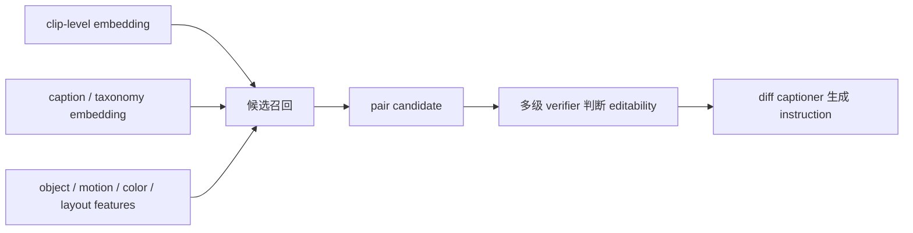
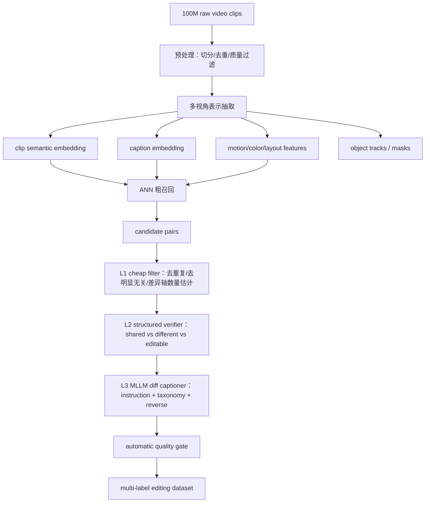
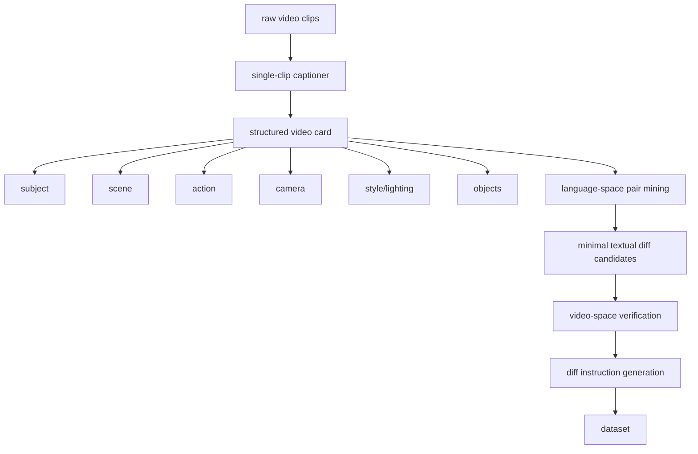
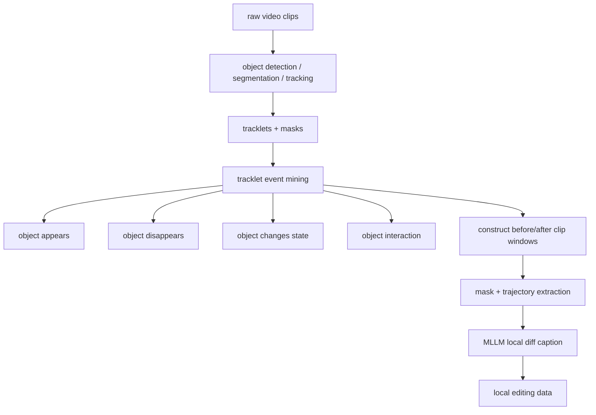
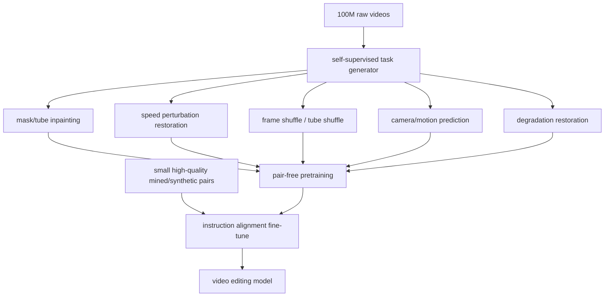
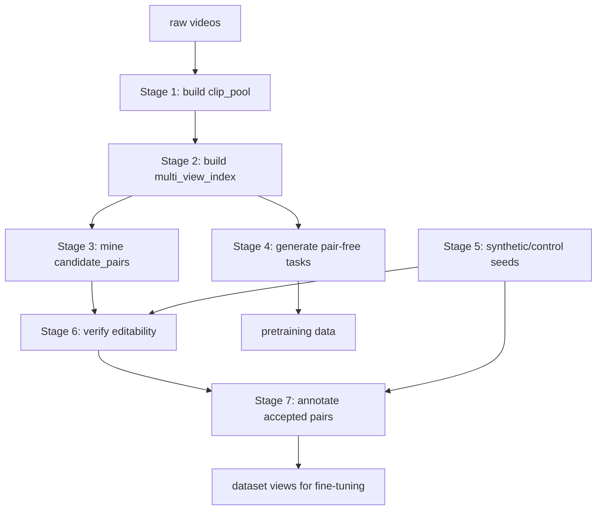
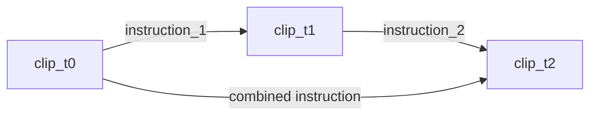
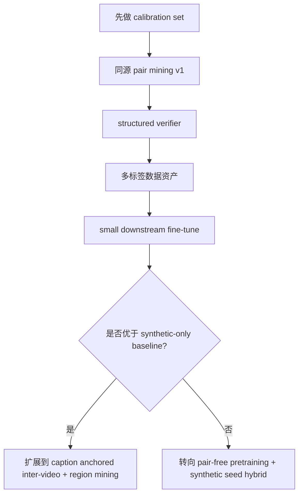

# Video Editing 数据集项目想法细化与 Pipeline Proposals

> 基于 `01_literature_survey.md` 的调研结论，本文件进一步把“从 100M 原始视频中无监督/弱监督挖掘 video editing 数据”的想法收敛成若干可落地 pipeline。这里不会假设具体 VLM / MLLM / editor 组件已定，而是明确数据流、核心判断、失败模式和 MVP 验证方式。

## 0. 一句话定位

我们要构建的不是一个简单的 `(source_video, instruction, edited_video)` 合成器，而是一个 **natural-video-driven editing data factory**：

> 从大规模自然视频中自动发现“可被编辑操作解释的变化”，把这些变化转成可训练的数据资产，并派生出 text instruction、reference image、mask、object trajectory、reverse instruction、multi-turn chain 等多种标签。

这条路线与主流合成数据路线的核心差异：

| 维度 | 主流合成路线 | 本项目自然挖掘路线 |
|---|---|---|
| source | 真实或生成视频 | 大规模真实视频 |
| instruction | LLM 主动想 | 从真实差异反推 |
| target | editing/generation model 合成 | 自然视频中已有变化，必要时少量合成补充 |
| 风险 | 蒸馏现有模型能力边界 | pair 噪声、diff 归因困难 |
| 优势 | 可控、taxonomy 明确 | 真实 motion、真实 camera、真实动态、可 scale |
| 最适合任务 | style、object add/remove/replace | motion、pose、state、viewpoint、camera、自然局部变化 |

---

## 1. 需要先修正的初始假设

### 1.1 不建议把“embedding diff”作为核心语义解释器

初始想法里有一个关键环节：

> video embedding A 和 B 很接近，然后用 `embedding_B - embedding_A` 得到 diff，再转成编辑指令。

这个思路可以保留为工程信号，但不建议作为主算法核心。原因：

- embedding space 通常服务 retrieval / semantic similarity，不等价于 edit space；
- 单个向量差无法稳定表达局部变化、motion、camera、identity、style 等多维因素；
- diff vector 很难直接自然语言化；
- 两个视频 embedding 接近，可能只是主题相同，并不是可编辑 pair。

更推荐的替代设计：



即：**embedding 用来召回，diff 解释交给 structured verifier + MLLM/diff captioner**。

### 1.2 “相似 pair”必须拆成两个问题

不要只问：“两个 clip 是否相似？”

应该问：

1. 两个 clip 是否共享足够多的可保留内容？
2. 它们的差异是否足够少？
3. 差异是否能被一个或少数几个编辑操作表达？
4. 差异是否属于我们想训练的 edit taxonomy？
5. instruction 是否覆盖全部重要差异，而不是只挑一个显著差异？

这五个条件缺一不可。

### 1.3 同源 pair 和异源 pair 必须分流

| Pair 类型 | 定义 | 优势 | 风险 | 适合任务 |
|---|---|---|---|---|
| 同源 intra-video | 同一视频不同时间片段/帧段 | identity、scene、style 保持更强 | 多数是自然时间变化，不一定像“编辑” | motion、pose、state、camera、object enter/exit |
| 近同源 near-duplicate | 同一事件/同一素材不同版本 | 非常接近真实 edit pair | 需要 metadata / fingerprint / copy detection | crop、color、subtitle、compression、minor cut |
| 异源 inter-video | 不同视频 embedding/caption 相似 | 覆盖面广 | false positive 极高，多差异纠缠 | style、background、object category、composition |

---

## 2. 数据资产定义

### 2.1 不要只存 triplet，要存 raw pair + labels

推荐把最底层数据定义为：

```text
EditCandidate {
  source_clip_id
  target_clip_id
  pair_origin: intra_video | near_duplicate | inter_video | synthetic_seed
  shared_content_summary
  difference_summary
  editability_score
  edit_types
  labels: {
    instruction_forward
    instruction_reverse
    reference_frames
    subject_crops
    masks_or_regions
    object_tracks
    keyframes
    verifier_scores
  }
}
```

原因：

- `(A, instruction, B)` 只是其中一种训练视图；
- 同一对 `(A, B)` 可以派生多个任务；
- 未来模型可能需要 reference、mask、trajectory、first-frame edit、multi-turn chain，不要把数据资产过早压扁。

### 2.2 一份 pair 可以派生多种训练格式

| 派生格式 | 数据形式 | 用途 |
|---|---|---|
| T2V instruction editing | `(A, instruction, B)` | text-only video editing |
| I2V/reference-guided editing | `(A, reference_image, instruction, B)` | 精确身份、纹理、风格控制 |
| Mask-conditioned editing | `(A, mask, instruction, B)` | 局部 add/remove/replace |
| First-frame propagation | `(A, edited_first_frame_of_B, B)` | AnyV2V / I2VEdit 类训练 |
| Reverse editing | `(B, reverse_instruction, A)` | 免费扩增与 consistency |
| Multi-turn editing | `(A, instr1, B, instr2, C)` | 长链编辑、状态变化 |
| Pair-free pretraining | `(A, degraded_A, reconstruction_task)` | motion/preservation prior |

---

## 3. 推荐首版 edit taxonomy

首版 taxonomy 不要太宽，否则 verifier 很难稳定。建议先覆盖 8 类：

| 一级类 | 子类 | 推荐来源 | 备注 |
|---|---|---|---|
| Motion / pose | pose change、gesture、action phase | 同源 pair | 自然视频最强项 |
| Camera / viewpoint | pan、zoom、dolly、view angle、multi-shot | 同源 + 异源 | 适合视频，不适合纯图像 |
| Object state | open/close、empty/full、on/off、wet/dry | 同源 | 需要 MLLM 判断 |
| Object presence | enter、exit、appear、disappear | 同源 + region mining | 可派生 mask |
| Object replacement | category/attribute replacement | 异源 + synthetic seed | 自然 pair 噪声高 |
| Appearance/style | color、lighting、weather、global style | 异源 + near-duplicate + synthetic | 需避免 scene entanglement |
| Background/location | background change、location shift | 异源 | text-only 很难精确，适合 reference |
| Playback/editing effect | speed、reverse、subtitle、crop、cut | near-duplicate + metadata | 更像后期编辑，价值高 |

首版应该 **优先做同源 motion/camera/state + near-duplicate post-production edit**，因为这两类天然质量最高。

---

## 4. Proposal A：自然视频 Pair Mining + 多级 Diff Verifier

### 4.1 目标

从 100M raw clips 中挖出高置信 `(clip_A, clip_B)`，再由 MLLM/diff captioner 生成可训练 instruction。

### 4.2 数据流



### 4.3 关键组件

#### 多视角表示

不要只用一种 embedding。建议至少四类：

- **semantic embedding**：视频整体内容；
- **caption embedding**：语言空间中找“只差几个词”的 pair；
- **motion representation**：光流、trajectory、action embedding；
- **object/region representation**：主体、mask、bbox、tracklet。

#### Pair filter 的结构化输出

每个候选 pair 先输出：

```json
{
  "shared_axes": ["subject", "scene", "style", "camera"],
  "different_axes": ["pose", "object_state"],
  "num_independent_differences": 2,
  "editable_differences": [
    {"type": "motion_pose", "description": "...", "confidence": 0.86}
  ],
  "reject_reasons": [],
  "editability_score": 0.0
}
```

只保留：

- shared axes 足够多；
- independent differences 不超过阈值；
- 所有主要 difference 都能被 instruction 覆盖；
- no identity swap unless explicitly target task。

### 4.4 优点

- 最贴近原始设想；
- 可直接 scale 到 100M；
- 输出是通用 raw pair asset；
- 能同时覆盖同源和异源。

### 4.5 主要风险

- 异源 pair false positive 高；
- MLLM 会过度解释；
- clip-level embedding 召回会混入大量“主题相似但不可编辑”的 pair；
- 成本可能集中在 L2/L3 verifier。

### 4.6 MVP 验证

先做 100K clips，不做 100M。

MVP 步骤：

1. 抽取 100K clips，其中 50K 允许同源相邻/间隔采样，50K 用跨视频 embedding retrieval。
2. 每个 clip 召回 top-50 candidates。
3. 用 cheap filter 保留 50K pair。
4. 用 frontier MLLM 精标 2K pair。
5. 人工标注 500 pair，统计：
   - valid edit pair precision；
   - instruction coverage；
   - difference axes count；
   - false positive 类型。

MVP 成功标准：

- 同源 pair precision > 60%；
- 异源 pair precision > 25% 才值得继续；
- 生成 instruction 中，人工认为“完整覆盖差异”的比例 > 70%；
- 至少 4 个 taxonomy 类别有可用样本。

---

## 5. Proposal B：Caption / Taxonomy Anchored Mining

### 5.1 目标

避免直接从 visual embedding diff 推语言。先把每个 clip 转成结构化 caption / attribute，再在语言空间找差异最小的 pair。

### 5.2 数据流



### 5.3 结构化 video card 示例

```json
{
  "subject": "a golden retriever",
  "scene": "grass field",
  "action": "running toward the camera",
  "camera": "static low-angle shot",
  "lighting": "sunny daylight",
  "style": "realistic handheld video",
  "objects": ["ball", "grass", "trees"],
  "temporal_events": ["dog starts far away", "dog approaches camera"]
}
```

Pair mining 规则：

- subject/scene/action 高重合；
- 只在一个字段上不同，比如 color、pose、camera、lighting；
- 字段差异必须映射到 taxonomy；
- 再回视频空间验证是否真的如此。

### 5.4 优点

- 绕开“embedding diff 不可解释”问题；
- instruction 生成更稳定，因为差异一开始就在语言空间；
- 更容易做 taxonomy balancing。

### 5.5 风险

- 单 clip caption 可能漏掉细节；
- caption 粒度不足会导致 pair 召回不准；
- 对 reference/texture/identity 这类难语言化信息不友好。

### 5.6 适合任务

- color / lighting / weather；
- object category / attribute；
- camera/viewpoint；
- action phase；
- background/location。

### 5.7 MVP 验证

1. 对 50K clips 生成 structured video card。
2. 按 taxonomy 设计 20 个 language diff pattern，例如：
   - same subject + same scene + different action；
   - same action + same scene + different camera；
   - same subject + different lighting。
3. 每个 pattern 采样 100 pair。
4. 人工评估每类 pair precision。

MVP 成功标准：

- 至少 5 个 pattern 的 valid rate > 40%；
- video card 的关键字段人工准确率 > 75%；
- pair 的 instruction hallucination 明显低于 Proposal A 的纯 embedding retrieval。

---

## 6. Proposal C：Region / Object Trajectory Anchored Local Edit Mining

### 6.1 目标

优先挖可局部编辑的数据：object enter/exit、object state change、局部遮挡、局部替换候选。这类数据最适合 mask-conditioned 和 reference-guided video editing。

### 6.2 数据流



### 6.3 可挖的数据类型

| 类型 | 构造方式 | 派生标签 |
|---|---|---|
| Object add | 同一视频中 object 从无到有 | mask、entry trajectory、instruction |
| Object remove | 反向使用 add pair | reverse instruction、mask |
| Object state change | 物体形态/状态变化前后窗口 | state caption、keyframe |
| Human pose/action | human tracklet 姿态变化 | pose keypoints、motion instruction |
| Local replacement candidate | 异源相同 scene/slot 中不同 object | reference crop、mask |

### 6.4 优点

- 更接近“可编辑区域”；
- mask/reference/trajectory 标签天然可得；
- 降低整段视频差异纠缠；
- 对训练 local edit preservation 很有价值。

### 6.5 风险

- tracking/segmentation 错误会污染数据；
- object disappear 可能只是遮挡，不是 remove；
- state change 需要语义判断；
- 自动 mask 质量影响下游模型。

### 6.6 MVP 验证

1. 选 10K clips 跑 object detection + SAM 2 tracking。
2. 挖 object appear/disappear events。
3. 构造 2K before/after windows。
4. MLLM 生成 local instruction。
5. 人工评估：
   - mask 是否覆盖目标；
   - 是否只有局部差异；
   - instruction 是否能解释变化。

MVP 成功标准：

- object appear/disappear event precision > 70%；
- mask usable rate > 80%；
- local instruction valid rate > 65%。

---

## 7. Proposal D：Pair-free Raw Video Pretraining + 少量 Pair Fine-tune

### 7.1 目标

承认自然 high-quality pair 稀缺，把 100M raw clips 主要用于 self-supervised editing prior，而不是强行挖 pair。

### 7.2 数据流



### 7.3 适合学习什么

- 保持未编辑区域；
- temporal consistency；
- motion propagation；
- occlusion recovery；
- local inpainting；
- camera/motion prior。

### 7.4 优点

- 最容易吃掉 100M raw clips；
- 不依赖 MLLM 大规模标注；
- 可作为所有其他 proposal 的基础预训练。

### 7.5 风险

- 不直接产出 instruction dataset；
- editing ability 需要后续 paired/instruction data 对齐；
- pretext task 设计不好会学到 restoration，而不是 editing。

### 7.6 MVP 验证

1. 选 1M clips 构造 3 类 pretext task：tube inpainting、speed perturbation、frame/tube shuffle。
2. 训练小模型或 adapter。
3. 用 10K high-quality editing pairs fine-tune。
4. 对比无 pretraining baseline 的：
   - temporal consistency；
   - source preservation；
   - local edit leakage；
   - instruction following。

MVP 成功标准：

- 同等 paired data 下，temporal consistency 和 preservation 明显提升；
- edit leakage 下降；
- 不牺牲 instruction compliance。

---

## 8. Proposal E：Hybrid Natural + Synthetic Seed Data Factory（推荐主路线）

### 8.1 执行目标

这条路线要产出三类数据。第一类是高置信 editing pair，格式是 `(clip_A, clip_B, edit_labels)`，用于后续导出 text instruction、reference-guided、mask-conditioned 等训练数据。第二类是 rejected hard negatives，格式是 `(clip_A, clip_B, reject_reason)`，用于训练和评估 verifier，让系统学会拒绝“看起来相似但不能作为编辑对”的视频。第三类是 pair-free pretraining data，格式是 `(raw_clip, corrupted_clip, reconstruction_task)`，用于让模型先学习视频时序一致性、局部保持和运动传播。

执行时不要从 `100M` 视频直接生成 instruction。先把原始视频变成可检索的 `clip_pool`，再从 `clip_pool` 产生候选 pair，然后用 verifier 判断候选 pair 是否能作为 editing data，最后只对通过 verifier 的 pair 做多标签标注。Synthetic seed 只用于校准 verifier 和 diff captioner，不作为主数据来源大规模混入最终训练集。

### 8.2 总体数据流



### 8.3 Stage 1：构建 `clip_pool`

先处理原始视频，不做 pair mining。把每个原始视频切成可训练、可检索、可回溯的 clips。长视频按 shot boundary 和固定窗口共同切分；如果 shot boundary 不稳定，就先用固定窗口，例如 4-8 秒一个 clip，窗口之间保留少量 overlap。每个 clip 必须写入 `video_id`、`clip_id`、起止时间、fps、分辨率、时长、原始文件路径或对象存储地址。后续所有 pair 都必须能追溯回原始视频和时间戳。

切完以后跑基础质量过滤。过滤黑屏、纯静态图、纯字幕页、严重模糊、过短、过长、低分辨率、重复帧比例过高、镜头切换过密的 clips。这里不要用 MLLM 做复杂判断，只用便宜的视觉统计、shot detector、OCR 比例、blur score、帧差、duration rule。这个阶段的需求是得到稳定的 `clip_pool`；如果 `clip_pool` 里混入大量坏视频，后面的 embedding、caption、verifier 都会浪费算力。

这个阶段输出一张 `clips` 表和一批标准化 clip 文件。`clips` 表里每一行是一个 clip，后面所有索引、候选 pair、标注结果都通过 `clip_id` 关联。

### 8.4 Stage 2：构建 `multi_view_index`

对 `clip_pool` 里的每个 clip 建多种索引。不要只算一个 video embedding，因为一个 embedding 只能回答“整体像不像”，不能回答“哪里不同、这个不同能不能当编辑”。至少要给每个 clip 生成四类信息：整体语义 embedding、结构化 caption、motion/camera 特征、object/region track。

整体语义 embedding 用于粗召回。它的作用是从 100M clips 里快速找到主题、场景、主体比较接近的候选，不负责最终判断。结构化 caption 用 VLM/MLLM 生成固定字段，例如 `subject`、`scene`、`action`、`camera_motion`、`viewpoint`、`lighting`、`style`、`visible_objects`、`temporal_events`。字段必须结构化存储，不要只存一段自由文本，否则后续无法按“只差一个字段”检索。

Motion/camera 特征用便宜模型或传统视觉方法抽取，例如 optical flow 强度、主体运动方向、camera pan/zoom/tilt 粗分类、motion magnitude、shot transition。Object/region track 用 detector + segmenter + tracker 生成，至少保存每个主要 object 的类别、bbox/mask、出现时间、消失时间、轨迹稳定性。这个阶段输出 `semantic_index`、`caption_index`、`motion_index`、`object_track_index`，后面的 candidate mining 只读这些索引，不重新扫原始视频。

### 8.5 Stage 3：生成 `candidate_pairs`

`candidate_pairs` 的意思是“候选视频对”。它还不是最终训练数据，只是我们从海量 clips 里先捞出来的一批“看起来可能能组成 editing 数据”的 `(clip_A, clip_B)`。后面还要经过 verifier 判断，只有通过的 pair 才会变成真正的 editing pair。这个阶段的目标不是一次性找准，而是用比较便宜的方法先把搜索范围缩小。

举一个最简单的例子。假设同一个视频里，前 5 秒是一只狗站在草地上，后 5 秒是同一只狗开始跑。我们可以先把这两个片段组成一个候选 pair：`clip_A = 狗站着`，`clip_B = 狗跑起来`。这个 pair 可能对应一个编辑指令：“让狗从站立变成跑动”。但现在它只是 candidate，还不能直接进训练集，因为我们还没确认背景、主体、镜头是否真的保持一致，也没确认中间有没有其他变化。

第一种找法是在同一个原始视频内部找 pair。具体做法是对每个 `video_id` 下面的 clips 按时间顺序两两配对，比如拿 `clip_t` 和 `clip_t+1`、`clip_t` 和 `clip_t+2` 做候选。配对后用前面建好的索引做初筛：如果两个 clips 的场景和主体很像，但动作、姿态、镜头运动或物体状态发生变化，就保留；如果两个 clips 几乎完全一样，就丢掉；如果两个 clips 中间发生大切镜，已经换了场景，也丢掉。这一路主要用来找同一主体的动作变化、姿态变化、镜头变化、物体进入/离开、状态变化。

第二种找法是在不同视频之间找 pair。这里不能简单地说“embedding 很像就配成一对”，因为两个视频可能只是都在拍狗，但狗不是同一只、背景也不同、动作也不同，这种 pair 不能直接当 editing 数据。更稳的做法是用文字索引先限制条件，例如找 `subject=狗`、`scene=草地`、`camera=静止` 都接近，但 `action` 一个是 `running`、一个是 `sitting` 的 clips。这样得到的候选 pair 至少有一个明确的候选差异：动作不同。每个异源候选都要记录它是因为哪个字段不同才被找出来的，例如 `candidate_diff = action: running -> sitting`。

第三种找法是围绕物体事件找 pair。比如一个视频里，桌子一开始是空的，几秒后桌上出现了一个杯子；或者一个人把门从关着变成打开。我们用 object detection、segmentation、tracking 先找到物体轨迹，再检测“出现、消失、位置变化、状态变化”这些事件。发现事件后，就把事件前的窗口当 `clip_A`，事件后的窗口当 `clip_B`，同时把这个物体的 mask、bbox、crop、trajectory 一起存下来。这一路主要产出局部编辑数据，例如添加物体、移除物体、移动物体、改变物体状态。

这个阶段最后输出一张 `candidate_pairs` 表。每一行是一对候选 clips，至少要写清楚：`source_clip_id` 是谁，`target_clip_id` 是谁，它来自同一个视频还是不同视频，是通过哪种方法找到的，当前怀疑它们差在哪里，以及支持这个判断的证据是什么。证据可以包括 caption 字段差异、embedding 距离、时间距离、object mask、object track 等。后面的 verifier 会读取这些证据，再决定这对 clips 是接受还是拒绝。

### 8.6 Stage 4：生成 pair-free pretraining 数据

这条线不生成 editing pair，也不生成 instruction。它直接从 `clip_pool` 生成自监督训练样本，用来训练模型的视频保持能力和时序建模能力。做法是对原始 clip 施加可逆或可监督的破坏，再要求模型恢复原 clip。

第一类任务是 spatial-temporal mask/tube inpainting。随机遮住一个 object track 或连续时空块，让模型根据上下文恢复。第二类任务是 motion perturbation，把局部帧段做 speed change、frame drop、frame repeat 或 tube shuffle，让模型恢复合理时间顺序。第三类任务是 degradation restoration，对 clip 加压缩、模糊、噪声、低分辨率、颜色扰动，让模型恢复干净视频。这些任务的 target 都是原始 clip，所以不需要人工标注，也不依赖 editing model 合成 target。

这个阶段的输出是 `pretrain_tasks`，用于先训练 video editor 的底层能力。它不解决 instruction following，但会降低后续 fine-tune 时的 temporal flicker、局部编辑泄漏、背景漂移。

### 8.7 Stage 5：构建 synthetic/control seed

这里的 synthetic seed 只做校准，不做主数据。先人工定义少量干净编辑类型，每类构造正例和反例。正例是确实只差一个编辑操作的 pair，例如颜色变化、物体移除、局部替换、风格变化。反例是看起来相似但不能作为编辑对的 pair，例如同主题不同主体、同场景但动作和镜头都变、差异过多、几乎没有差异、instruction 无法覆盖全部变化。

用这些 seed 训练或校准两个模块。第一个是 verifier，让它学会判断 pair 是否应该被接受，尤其是学会拒绝 hard negatives。第二个是 diff captioner，让它学会只描述差异，不复述共同内容，不漏掉重要变化。如果使用 frontier MLLM 做标注，也要先用这批 seed 评估 prompt 和输出 schema，确认它不会系统性过度接受坏 pair。

推荐第一版只做 10K-50K synthetic/control seed。不要在这里投入百万级合成数据，因为这会回到旧路线：最终模型又开始蒸馏现有 editing/generation model。

### 8.8 Stage 6：用 verifier 过滤 `candidate_pairs`

所有 `candidate_pairs` 都必须先过 verifier，不能直接写 instruction 进训练集。Verifier 的输入是两个 clips 加上 mining 阶段留下的证据，包括结构化 caption、candidate diff、embedding score、object track、mask、时间关系。Verifier 的输出必须是结构化结果，不要只输出一段自然语言评价。

Verifier 要先判断两个 clip 共享什么，再判断差异是什么。它必须列出 `shared_axes`，例如主体、场景、背景、镜头、风格；也必须列出 `different_axes`，例如动作、姿态、物体状态、camera motion、lighting。然后它要判断差异数量是否过多，是否存在未被候选 diff 覆盖的重要差异，是否需要 reference 或 mask 才能表达。如果主体 identity 不一致但任务不是 object/subject replacement，直接 reject。如果背景、主体、动作、镜头同时变化，直接 reject。如果需要三条以上 instruction 才能解释 target，也 reject。

Verifier 输出两张表。通过的写入 `accepted_pairs`，字段包括 `source_clip_id`、`target_clip_id`、`edit_types`、`editability_score`、`needed_conditions`、`verifier_rationale`。拒绝的写入 `rejected_pairs`，字段包括 `source_clip_id`、`target_clip_id`、`reject_reason`、`hard_negative_type`。`rejected_pairs` 不能丢，它是后续训练 verifier 和评估 false positive 的关键数据。

### 8.9 Stage 7：给 `accepted_pairs` 做多标签标注

只对 `accepted_pairs` 做标注。标注器读取 pair、verifier 结果和 supporting metadata，然后生成 forward instruction。Instruction 必须只描述从 A 到 B 的必要变化，不要重复描述 A 和 B 共有的内容。如果文字无法精确表达 target 的视觉细节，例如具体身份、纹理、复杂物体形状，就把 `needs_reference` 设为 true，并从 target clip 里选择 reference frame 或 object crop。

同一条 pair 还要生成 reverse instruction。不是所有 pair 都可逆，例如 object appear 的反向可以是 remove object，但 state change 的反向可能不自然；所以 reverse instruction 也要有 `reverse_valid` 字段。对于 local edit，必须把 object/region mining 里得到的 mask 或 track 绑定到 label；如果没有稳定 mask，就不要导出 mask-conditioned 版本。对于 motion/camera edit，要保存关键帧对应关系，例如 source 哪几帧对应 target 哪几帧，方便后续训练 temporal alignment。

这个阶段输出 `edit_labels`。最低要求包括 `instruction_forward`、`edit_taxonomy`、`editability_score`、`pair_origin`。推荐同时输出 `instruction_reverse`、`reference_frame_or_crop`、`mask_sequence`、`keyframe_alignment`、`label_confidence`。后续数据导出只从 `accepted_pairs + edit_labels` 生成，不再临时调用 MLLM。

### 8.10 Stage 8：导出训练数据

导出时不要把所有样本混成一个大 JSON。按训练任务导出不同 view。Text instruction editing 使用 `(source_clip, instruction_forward, target_clip)`。Reference-guided editing 使用 `(source_clip, instruction_forward, reference_frame_or_crop, target_clip)`。Mask-conditioned editing 使用 `(source_clip, instruction_forward, mask_sequence, target_clip)`。Pair-free pretraining 使用 `(corrupted_clip, reconstruction_task, original_clip)`。Benchmark 使用人工确认过的正例、反例和 hard negatives。

每个 view 都要保留 `pair_origin` 和 `edit_taxonomy`。训练时先用 `pretrain_tasks` 做 self-supervised pretraining，再用高置信 `NaturalPairs / Reference / MaskLocal` 做 instruction alignment fine-tuning。不要把低置信 pair 混入主训练集；低置信 pair 可以进入 verifier 训练或 active learning 队列。

### 8.11 第一版只实现哪些部分

第一版只做最小闭环。先取 100K clips，完成 `clip_pool`、`multi_view_index`、同源 pair mining、synthetic/control seed、verifier、accepted pair 标注和 text instruction 导出。暂时不要全量做 100M，也不要大规模开放异源 pair mining。异源 pair 和 object/region mining 可以先做小样本评估，不进入主训练集。

第一版的验收标准要直接对应数据质量。`accepted_pairs` 人工 precision 至少要超过 60%，instruction 完整覆盖主要差异的比例至少超过 70%，hard negatives 的拒绝率要明显高于直接问 MLLM 的 baseline。拿这批数据 fine-tune 一个小模型后，motion/camera/state edit 至少要在人工评估或 benchmark 上优于 synthetic-only baseline，否则不要 scale。

---

## 9. 首阶段 Implementation Plan

### 9.1 Stage 0：定义 calibration set

这是最重要的第一步，不建议省略。

构造 2,000 pair：

- 500 同源 positive；
- 500 同源 hard negative；
- 500 异源 candidate；
- 500 synthetic/control pair。

人工标注字段：

```json
{
  "is_valid_edit_pair": true,
  "edit_types": ["motion_pose"],
  "num_independent_differences": 1,
  "shared_content_axes": ["subject", "scene", "style"],
  "unacceptable_differences": [],
  "best_instruction": "Make the dog sit down while keeping the same park scene.",
  "needs_reference": false,
  "needs_mask": false,
  "confidence": 4
}
```

这个 set 用来评估：

- pair mining precision；
- MLLM verifier；
- diff captioner；
- automatic metrics；
- hard negative rejection。

### 9.2 Stage 1：100K-1M Pilot 数据处理

输入：

- 100K 或 1M raw clips；
- 每个 clip 保留 source video id、timestamp、duration、fps、resolution。

处理：

- 去重与质量过滤；
- 抽 keyframes；
- 生成 clip embedding；
- 生成 structured video card；
- 可选：object detection / tracking。

输出：

- `clip_index`；
- `embedding_index`；
- `caption_index`；
- `object_track_index`。

### 9.3 Stage 2：三路 candidate mining

三路同时跑：

1. **Intra-video temporal mining**
   - 同一视频内采样间隔不同的 clip；
   - 优先找 shared scene + moderate change；
   - 过滤 scene cut 太大或几乎完全不变。

2. **Caption/taxonomy anchored inter-video mining**
   - 用 structured video card 找字段只差一个的 pair；
   - 再用 visual embedding 验证相似度。

3. **Region/object event mining**
   - 找 object appear/disappear/state change；
   - 输出 mask/tracklet。

### 9.4 Stage 3：Structured verifier

Verifier 不直接问：

> Can A be edited into B?

而是固定问：

1. Clip A 的 subject / scene / action / camera / style；
2. Clip B 的同字段；
3. 共同点；
4. 全部差异；
5. 每个差异是否可编辑；
6. 是否需要 mask/reference；
7. 差异数量是否过多；
8. 最终 accept/reject；
9. 若 accept，输出 instruction。

硬拒绝条件：

- 主体 identity 不一致，且任务不是 explicit replacement；
- 背景、主体、动作、camera 同时变化；
- 需要三条以上 instruction 才能解释；
- target 中出现 source 中无关的新主体但 instruction 没覆盖；
- MLLM 不确定或多次采样答案不一致。

### 9.5 Stage 4：多标签派生

每个 accepted pair 尽量一次性派生：

- forward instruction；
- reverse instruction；
- edit taxonomy；
- edit locality；
- reference frame/crop；
- mask/region suggestion；
- keyframe alignment；
- hard negative reason if rejected。

不要为了省字段把信息丢掉。

### 9.6 Stage 5：Quality funnel accounting

每个阶段都记录：

```text
raw clips
→ valid clips
→ retrieved candidate pairs
→ cheap-filter pairs
→ verifier-accepted pairs
→ caption-valid pairs
→ human-verified estimated precision
→ downstream-useful pairs
```

这是后续决定是否 scale 到 100M 的核心依据。

---

## 10. MLLM Prompt 设计原则

### 10.1 Pair verifier prompt 的关键约束

必须让模型“允许拒绝”，并明确拒绝标准：

```text
You are evaluating whether two video clips can form a clean video editing training pair.
Your job is not to force an instruction. Reject if the clips differ in too many independent ways.

Analyze:
1. Shared content that should be preserved.
2. All visible differences, including subtle ones.
3. Which differences are editable operations.
4. Whether a single concise instruction can explain all important target differences.
5. Whether the pair needs a visual reference or mask.

Return JSON only.
```

### 10.2 Caption prompt 的关键约束

Instruction 只描述变化，不复述共同内容：

```text
Write an editing instruction that transforms clip A into clip B.
The instruction must describe only the necessary changes.
Do not mention content that should remain unchanged unless needed for preservation.
If visual details cannot be described precisely in text, set needs_reference=true.
```

### 10.3 为什么要结构化而非自由文本

自由文本会导致：

- 模型漏掉差异；
- 过度解释；
- 评分不可比较；
- 无法做自动过滤。

结构化 JSON 可以直接进入数据仓库和 evaluator。

---

## 11. Evaluation 设计

### 11.1 Intrinsic evaluation

用于评估数据本身：

- pair valid precision；
- edit type accuracy；
- instruction completeness；
- instruction minimality；
- preservation axes correctness；
- mask/reference usability；
- hard negative rejection rate；
- taxonomy balance。

### 11.2 Extrinsic evaluation

用于评估数据是否真的有用：

- 用 pilot 数据 fine-tune 小 video editing model；
- 在 IVEBench / OpenVE-Bench / 自建 benchmark 上测试；
- 对比：
  - no mined data；
  - synthetic-only data；
  - mined-only data；
  - hybrid data。

关键指标：

- instruction compliance；
- source preservation；
- temporal consistency；
- local edit leakage；
- human preference。

### 11.3 必须包含 hard negatives

Hard negatives 包括：

- 同主题不同人；
- 同场景不同主体；
- 同主体但背景/action/camera 都变；
- 几乎重复没有有效 edit；
- 视频质量差或 cut 太多；
- MLLM 很容易硬解释的伪 pair。

没有 hard negatives，verifier 会虚高。

---

## 12. Scale-up 策略

### 12.1 不建议一开始全量 100M

推荐节奏：

| 阶段 | 规模 | 目的 |
|---|---:|---|
| Pilot-0 | 2K pair calibration | 标注 schema 和 verifier 校准 |
| Pilot-1 | 100K clips | 验证 mining precision |
| Pilot-2 | 1M clips | 验证成本、throughput、类别覆盖 |
| Scale-1 | 10M clips | 训练首个可用数据集版本 |
| Scale-2 | 100M clips | 只在 funnel 指标达标后执行 |

### 12.2 Cascade 成本控制


原则：

- frontier MLLM 只用于最后 1-5%；
- 大多数 pair 应该在 cheap stage 被拒绝；
- open model 可用于批量初筛和 taxonomy routing；
- human annotation 用于 calibration，不用于主规模生产。

---

## 13. 当前最推荐的 v1 路线

### 13.1 v1 不做什么

暂时不要：

- 不要直接全量 100M；
- 不要把 `embedding_B - embedding_A` 当作 instruction generator；
- 不要让 MLLM 对所有候选 pair 直接写 instruction；
- 不要优先做异源 pair 大规模标注；
- 不要只产 text-only triplet。

### 13.2 v1 做什么

建议 v1 聚焦：

1. **同源 clip pair mining**
   - 学 InstructMove 的成功经验，但从 frame pair 扩展到 clip pair；
   - 主攻 motion、pose、camera、state。

2. **structured verifier + calibration set**
   - 这是数据质量生命线；
   - 先让 verifier 学会拒绝。

3. **多标签资产存储**
   - forward/reverse instruction；
   - taxonomy；
   - reference/mask/keyframe metadata。

4. **小规模 downstream 验证**
   - 只要证明 mined data 能提升 motion/camera/state editing，就值得继续。

### 13.3 v1 目标数据规模

合理目标：

- 100K clips pilot；
- 50K-200K candidate pairs；
- 5K-20K accepted high-confidence pairs；
- 500-1,000 human-reviewed samples；
- 3-5 个 edit categories 有稳定数据。

这个规模足够判断路线是否 work，不会烧掉 100M 资源。

---

## 14. 发散方向

### 14.1 近重复视频挖后期编辑数据

很多平台上存在同一素材的不同版本：

- 加字幕 / 去字幕；
- 裁剪 / 变焦；
- 调色 / 滤镜；
- 加 logo / 水印；
- 压缩 / 分辨率变化；
- slow motion / speed change。

这类数据非常像真实 video editing pair，建议单独建 near-duplicate mining pipeline。

### 14.2 从同一视频构造 multi-turn chain

同一视频中取 `clip_t0, clip_t1, clip_t2`：



可训练：

- multi-turn editing；
- state progression；
- action continuation；
- camera movement chain；
- long-horizon consistency。

### 14.3 用自然 pair 训练 diff captioner，再反哺 mining

先人工/MLLM 标 5K 高质量 pairs，训练轻量 diff captioner/verifier。

然后：

- 用它批量打分 10M pair；
- 只把高置信/低置信样本送 frontier MLLM；
- 中间置信样本进入 active learning。

### 14.4 把 rejected pairs 也变成资产

Rejected pairs 可以训练 verifier：

- “为什么这不是 edit pair”；
- “差异太多”；
- “identity 不一致”；
- “instruction 无法覆盖全部变化”。

这些 hard negatives 对后续自动化极有价值。

### 14.5 自然 pair + synthetic counterfactual

对自然挖到的 pair，如果只有一个差异不干净，可以用 synthetic model 做轻量修补：

- 保留自然 source；
- 用自然 target 提供 reference；
- 只合成局部 mask；
- 用 verifier 确保没有引入额外变化。

这样不是完全蒸馏 editing model，而是用合成补齐自然 pair 的局部缺陷。

---

## 15. 最终建议

最稳的项目路线是：



核心原则：

- **先证明自然数据能产生有效 editing signal，再谈 100M scaling**。
- **先做高 precision 小数据，不要追求大规模低质量 triplet**。
- **把 MLLM 当 verifier/captioner，不当 oracle**。
- **把 pair 作为底层资产，不要只导出 text instruction 数据**。
- **把 hard negatives、rejected pairs、verifier scores 一起存下来**。

如果 v1 成功，项目的真正价值不是得到一个数据集，而是得到一个持续滚动的数据工厂：每次换更强的视频 encoder、MLLM、segmenter、editing verifier，都能在同一套 raw video pool 上重跑并提升数据质量。
